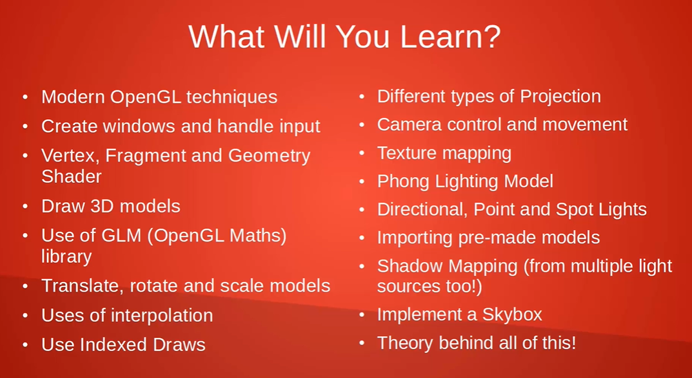

# 🎯 Learning Journey Tracker – 3D Renderer Development

This file tracks my progress across:
- C++ language foundations (Cherno course)
- OpenGL rendering pipeline (Udemy course)
- My own 3D renderer using SDL2 + OpenGL

---

## 🧱 Phase 1: Core C++ (Cherno – `learning.cpp`)
- [X] Functions and headers
- [x] Classes and objects
- [X] Pointers and memory
- [X] References, const, and value types
- [ ] Data structures (vectors, maps)
- [ ] File organization
- [ ] Build systems (make/CMake basics)

Track:
- 1 VIDEO
- 1 VIDEO
- 1 VIDEO
- 1 VIDEO
- 1 VIDEO
- 1 VIDEO
- 1 VIDEO
- 1 VIDEO
- 1 VIDEO
- 1 VIDEO
- 1 VIDEO
- 1 VIDEO
- 1 VIDEO
- 1 VIDEO
- 1 VIDEO
- 1 VIDEO
- 1 VIDEO
- 1 VIDEO
- 1 VIDEO
- 1 VIDEO
- 1 VIDEO
- 1 VIDEO
- 1 VIDEO
- 1 VIDEO
- 1 VIDEO // Be careful in c++ not to write out of array bounds and break memory alocation
- 1 VIDEO
- 1 VIDEO
- 1 VIDEO
- 1 VIDEO
//Check point of the C++ series: video 35, "Memory inicializer Lists in C++"

---

## 🔺 Phase 2: OpenGL Concepts (Udemy – `course-opengl/`)
- [X] GLFW window setup
- [ ] GLEW initialization
- [ ] Drawing a triangle
- [ ] Shaders: Vertex and Fragment
- [ ] VBOs, VAOs, EBOs //Vertex Buffer Objects (defines the actual values) and Vertex Array Objects (defines the parameters)
- [ ] Model loading with Assimp
- [ ] Camera system
- [ ] Lighting (Phong shading, etc.)

 //temp

Section 1:
  - 1 VIDEO
  - 1 VIDEO
  - 1 VIDEO
Section 2:
  - 1 VIDEO
  - 1 VIDEO
  - 1 VIDEO
  - 1 VIDEO
  - 1 VIDEO
  + fix
  + research
  - 1 VIDEO
  - 1 VIDEO
  - 1 VIDEO
  - 1 VIDEO
  - 1 VIDEO
  - 1 VIDEO
  - 1 VIDEO
Section 3:
Section 4:
Section 5:
Section 6:

---

## 🌀 Phase 3: My SDL2 Engine (in `renderer/`)
- [ ] SDL2 window and OpenGL context
- [ ] Input handling (keyboard + mouse)
- [ ] Triangle rendering
- [ ] Shaders and buffers
- [ ] Model loader
- [ ] Camera + physics
- [ ] Interaction and UI (ImGui)

---

## ✅ Easy Daily Commit Ideas
- [ ] Add a note or idea to this file
- [ ] Check off a box you completed
- [ ] Rename/refactor a function
- [ ] Add comments to explain a block
- [ ] Write a small helper function
- [ ] Update `README.md`
- [ ] Add a dev log (e.g. `log-2025-06-07.md`)

cd:cd /c/Users/lanac/OneDrive/Desktop/3D-Renderer
